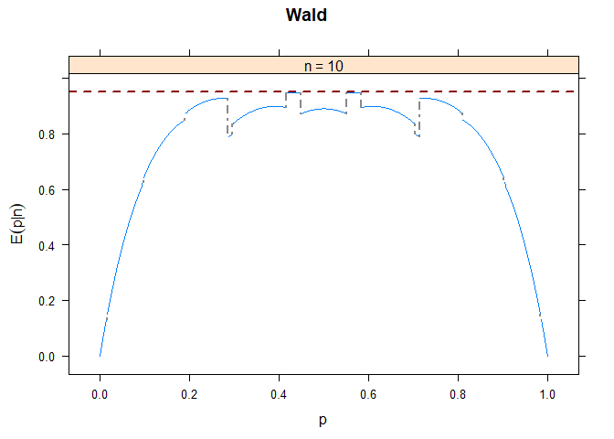
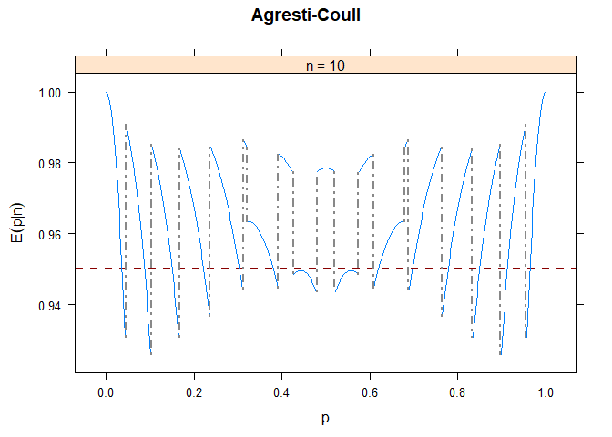
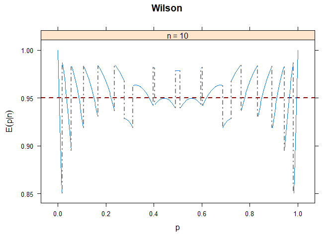
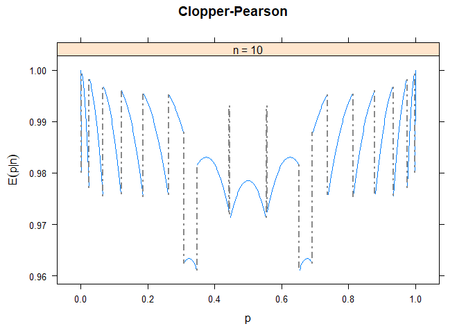

Chp1 Q13
================

a). Verify the 95% LR confidence interval

``` r
library(binom)
binom.confint(x = 4, n = 10, conf.level = 0.95, methods = 'lrt')
```

    ##   method x  n mean     lower     upper
    ## 1    lrt 4 10  0.4 0.1456425 0.7000216

b).

``` r
#true confidence levels can be found using 'binom' package
library(binom)
binom.coverage(p = 0.4, n = 10, conf.level = 0.95, 
               method = c("asymptotic", "agresti-coull", 
                          "wilson", "exact"))
```

    ##          method   p  n  coverage
    ## 1 agresti-coull 0.4 10 0.9816588
    ## 2    asymptotic 0.4 10 0.8988807
    ## 3         exact 0.4 10 0.9816588
    ## 4        wilson 0.4 10 0.9816588

``` r
binom.plot(n = 10, method = binom.asymp, np = 500, conf.level = 0.95, main = "Wald")
```

    ## Loading required package: lattice

<!-- -->

``` r
binom.plot(n = 10, method = binom.agresti.coull, np = 500, conf.level = 0.95, main = "Agresti−Coull")
```

<!-- -->

``` r
binom.plot(n = 10, method = binom.wilson, np = 500, conf.level = 0.95, main = "Wilson")
```

<!-- -->

``` r
binom.plot(n = 10, method = binom.exact, np = 500, conf.level = 0.95, main = "Clopper−Pearson")
```

<!-- -->

c). According to the graphs in b), the Wilson interval and the
Agresti-Coull interval performs very good, with Wilson interval to be
slightly better than Agresti-Coull.

The Wald interval performs the worst, because is tends to be very far
away from 0.95 the most often.

The Clopper−Pearson performs too conservative. The true confidence level
is mostly between 0.96 to 0.995.

The Wilson interval performs slightly better than the Agresti-Coull
interval when the p isn’t extreme.
