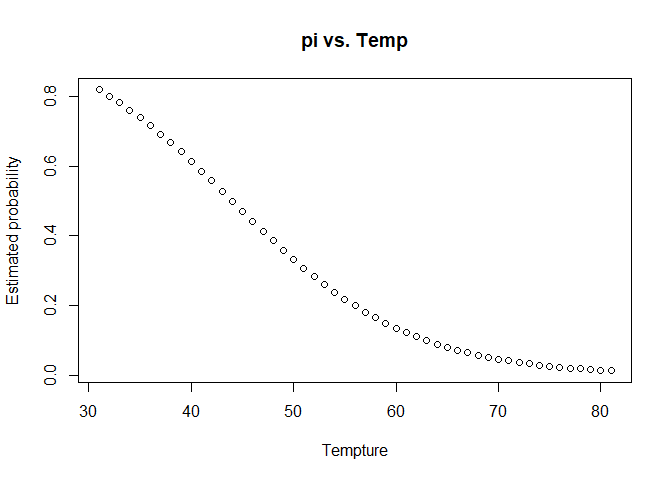
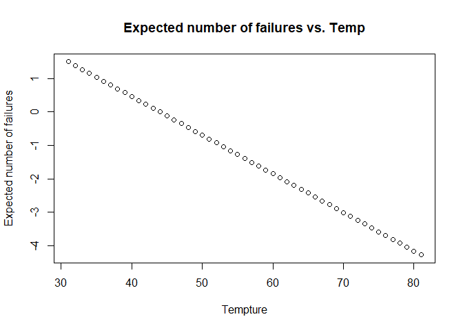
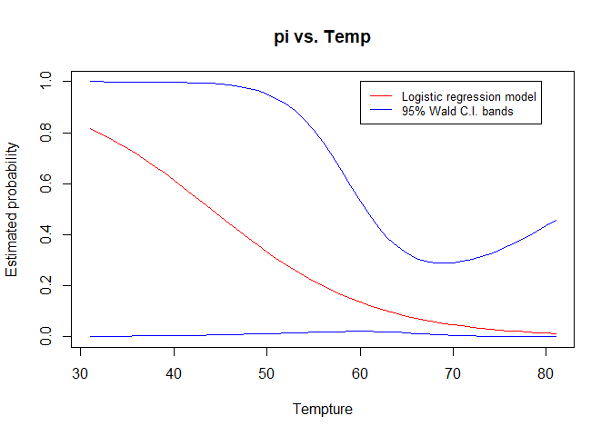

Chp2 Q5
================

a). The estimated logistic regression model is: logit(pi.hat) = 5.085 -
0.1156Temp

``` r
challenger <- read.table(file = "challenger.csv", 
                          header = TRUE, sep = ",")

challenger.fit <- glm(formula = O.ring/Number ~ Temp, 
                      family = binomial, 
                      data = challenger) 
```

    ## Warning in eval(family$initialize): non-integer #successes in a binomial glm!

``` r
#there is nothing wrong with this warning message, glm() is just picky when it comes to specifying binomial models

summary(challenger.fit)
```

    ## 
    ## Call:
    ## glm(formula = O.ring/Number ~ Temp, family = binomial, data = challenger)
    ## 
    ## Deviance Residuals: 
    ##      Min        1Q    Median        3Q       Max  
    ## -0.38876  -0.31965  -0.22093  -0.01788   1.08248  
    ## 
    ## Coefficients:
    ##             Estimate Std. Error z value Pr(>|z|)
    ## (Intercept)   5.0850     7.4770   0.680    0.496
    ## Temp         -0.1156     0.1152  -1.004    0.316
    ## 
    ## (Dispersion parameter for binomial family taken to be 1)
    ## 
    ##     Null deviance: 4.0384  on 22  degrees of freedom
    ## Residual deviance: 3.0144  on 21  degrees of freedom
    ## AIC: 7.2026
    ## 
    ## Number of Fisher Scoring iterations: 6

b).

``` r
linear.pred <- challenger.fit$coefficients[1] + challenger.fit$coefficients[2] * 31:81
pi.hat <- as.numeric(exp(linear.pred)/(1 + exp(linear.pred)))

plot(x = c(31:81), y = pi.hat, xlab = 'Tempture', 
     ylab = "Estimated probability", main = "pi vs. Temp")
```

<!-- -->

``` r
plot(x = c(31:81), y = linear.pred, xlab = 'Tempture', 
     ylab = "Expected number of failures", main = "Expected number of failures vs. Temp")
```

<!-- -->

c). Bands are much wider for lower temperatures than for higher
temperatures, because the calculation for Wald confidence interval for
pi involves e to the power of “x”. the value of “x” on the lower bands
tend to be extreme, which makes Wald confidence interval to be wide.

``` r
predict.data <- data.frame(Temp = 31:81) #create a data frame contains desired temperatures. 

linear.pred2 <- predict(object = challenger.fit,
                       newdata = predict.data,
                       type = "link",
                       se = TRUE)

pi.hat <- exp(linear.pred2$fit) / (1 + exp(linear.pred2$fit))

CI.lin.pred.upper <- linear.pred2$fit + 1.96 * linear.pred2$se
CI.pi.upper <- exp(CI.lin.pred.upper) / (1+exp(CI.lin.pred.upper))

CI.lin.pred.lower <- linear.pred2$fit - 1.96 * linear.pred2$se
CI.pi.lower <- exp(CI.lin.pred.lower) / (1+exp(CI.lin.pred.lower))

x <- data.frame(predict.data, pi.hat, 
           lower = CI.pi.lower, 
           upper = CI.pi.upper)

plot(x = c(31:81), y = pi.hat, xlab = 'Tempture', 
     ylab = "Estimated probability", main = "pi vs. Temp", ylim = c(0,1),
     type = "l", col = c("red"))
lines(x$Temp, x$upper, col = c("blue"))
lines(x$Temp, x$lower, col = c("blue"))
legend(60,1,legend=c("Logistic regression model",
                     "95% Wald C.I. bands"), 
       col=c("red", "blue"), 
       lty=1:1, cex=0.8)
```

<!-- -->

d). At temperature 31, it has 0.8178 failure rate and confidence
intervals are (0.0019, 0.9999). The assumptions needed are: assumption
of independence and assumes that the model follows logistic regression.

``` r
x[1,]
```

    ##   Temp    pi.hat       lower     upper
    ## 1   31 0.8177744 0.001935591 0.9999037

e).

``` r
beta0 <- 5.085
beta1 <- -0.1156

  # Explanatory variable values and corresponding pi's
  set.seed(321)
  x1<-runif(n = 966, min = 31, max = 72)
  pi<-exp(beta0 + beta1*x1) / (1 + exp(beta0 + beta1*x1))

  # Set seed number to reproduce results and simulate responses
  set.seed(123)
  y<-rbinom(n = length(x1), size = 966, prob = pi)/966
  
  # Estimate model
  mod.fit<-glm(formula = y ~ x1, family = binomial(link = logit))  # no data argument needed
```

    ## Warning in eval(family$initialize): non-integer #successes in a binomial glm!

``` r
  mod.fit$coefficients
```

    ## (Intercept)          x1 
    ##   5.0921633  -0.1157363

``` r
predict.data <- data.frame(x1 = c(31,72)) #create a data frame contains desired temperatures. 

linear.pred2 <- predict(object = mod.fit,
                       newdata = predict.data,
                       type = "link",
                       se = TRUE)

pi.hat <- exp(linear.pred2$fit) / (1 + exp(linear.pred2$fit))

CI.lin.pred.upper <- linear.pred2$fit + 1.96 * linear.pred2$se
CI.pi.upper <- exp(CI.lin.pred.upper) / (1+exp(CI.lin.pred.upper))

CI.lin.pred.lower <- linear.pred2$fit - 1.96 * linear.pred2$se
CI.pi.lower <- exp(CI.lin.pred.lower) / (1+exp(CI.lin.pred.lower))

data.frame(predict.data, pi.hat, 
           lower = CI.pi.lower, 
           upper = CI.pi.upper)
```

    ##   x1    pi.hat      lower      upper
    ## 1 31 0.8182205 0.76785258 0.85965762
    ## 2 72 0.0376570 0.02518358 0.05595386

f). A quadratic term is not needed in the model for the temperature.
Notice that the simulated data are well fitted into the logistic
regression model

``` r
summary(mod.fit)
```

    ## 
    ## Call:
    ## glm(formula = y ~ x1, family = binomial(link = logit))
    ## 
    ## Deviance Residuals: 
    ##       Min         1Q     Median         3Q        Max  
    ## -0.097063  -0.022493  -0.000101   0.022165   0.114142  
    ## 
    ## Coefficients:
    ##              Estimate Std. Error z value Pr(>|z|)    
    ## (Intercept)  5.092163   0.394214   12.92   <2e-16 ***
    ## x1          -0.115736   0.008086  -14.31   <2e-16 ***
    ## ---
    ## Signif. codes:  0 '***' 0.001 '**' 0.01 '*' 0.05 '.' 0.1 ' ' 1
    ## 
    ## (Dispersion parameter for binomial family taken to be 1)
    ## 
    ##     Null deviance: 289.5540  on 965  degrees of freedom
    ## Residual deviance:   1.0558  on 964  degrees of freedom
    ## AIC: 563.42
    ## 
    ## Number of Fisher Scoring iterations: 5
